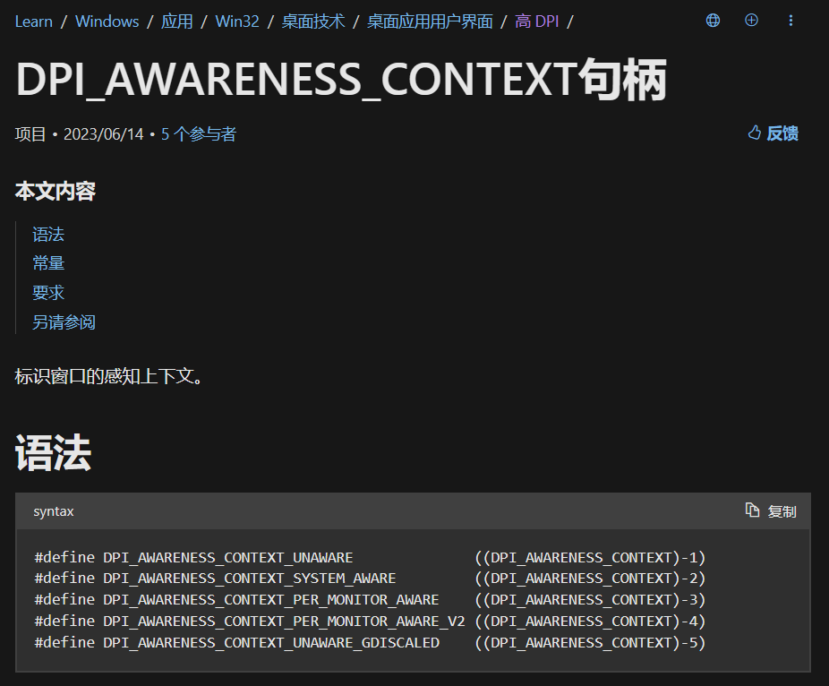
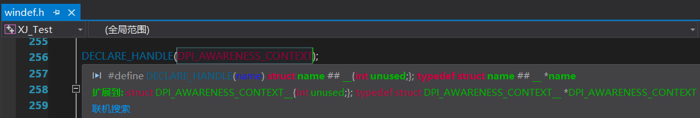
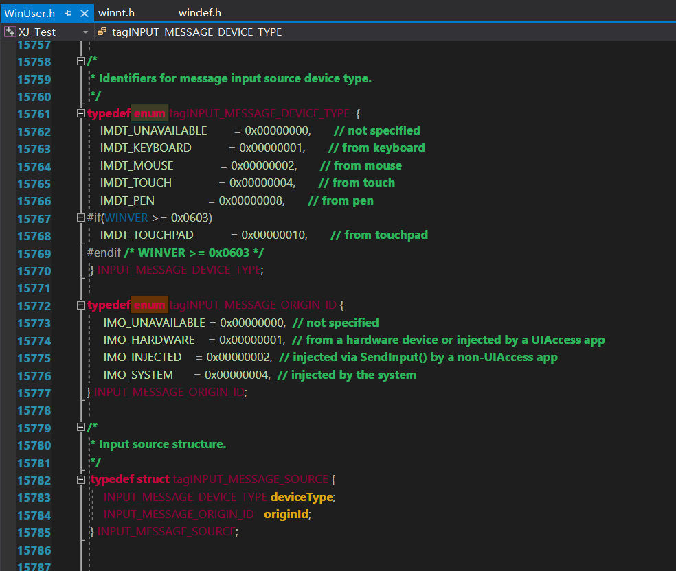

其实我也不知道怎么形容这种奇怪的语法。

winAPI不是喜欢搞各种的宏吗，宏的展开还是一些奇奇怪怪的东西，而这里提到的“指针宏”就是形容这种怪东西，用MSDN文档来形容就是“句柄”。

多说无用，直接截图，因为这已经超出了我的语言能力了(或者说我根本不知道怎么描述这怪异的用法)。


***

有个winAPI，``SetThreadDpiAwarenessContext``，用于设置DPI感知，它接受的是类型为``DPI_AWARENESS_CONTEXT``的参数，而这参数不能随意填入，只能使用以下的可选值：




<br>

可以看到上面这些可选值实际上都是一些宏而已，那么问题来了，``DPI_AWARENESS_CONTEXT``是什么东西？去IDE中查看，得到的结果是：



简而言之就是``DPI_AWARENESS_CONTEXT``是一个指针(或者说是句柄)，而且通过一个怪异的加减语法``(DPI_AWARENESS_CONTEXT)-3``就能将一个数值变为指针，它的效果等同于``DPI_AWARENESS_CONTEXT(-3)``。
关于为什么用这种怪用法暂按不表，至少知道它等效于将一个具体数值强制转换即可。

<br>

可还是很想吐槽，放着C枚举enum不用，搞这些东西。
可别说winAPI没用过枚举啊，随便打开一个win头文件然后搜索``enum``就已经有不少的匹配项。
算了，随它。




<br>

***

因此，调用这一类的winAPI时，如果没有相应的宏，直接填写数值即可，
以Python调用``SetThreadDpiAwarenessContext``作为举例：

```py
from ctypes import CDLL
user32=CDLL('user32.dll')

#win32con没有DPI_AWARENESS_CONTEXT_PER_MONITOR_AWARE，于是直接填写对应值-3，
user32.SetThreadDpiAwarenessContext(-3)
#这种情况在调用winAPI时非常常见，
#例如找不到宏WM_DPICHANGED，就只能填写对应值736。
```


<br>
<br>


# 参考：
- DPI_AWARENESS_CONTEXT：[https://learn.microsoft.com/zh-cn/windows/win32/hidpi/dpi-awareness-context](https://learn.microsoft.com/zh-cn/windows/win32/hidpi/dpi-awareness-context)
- SetThreadDpiAwarenessContext：[https://learn.microsoft.com/zh-cn/windows/win32/api/winuser/nf-winuser-setthreaddpiawarenesscontext](https://learn.microsoft.com/zh-cn/windows/win32/api/winuser/nf-winuser-setthreaddpiawarenesscontext)

