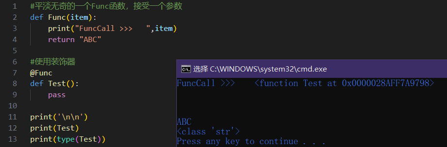
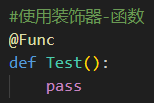
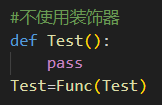

这里说一下Python装饰器的本质。


# 代码：

```py
#平淡无奇的一个Func函数，接受一个参数
def Func(item):
	print("FuncCall >>>   ",item)
	return "ABC"

#使用装饰器
@Func
def Test():
	pass

print('-------------------')
print(Test)
print(type(Test))
```

# 运行结果：




# 说明：
- 窗口输出的``FuncCall >>> XXXXXX``，说明Func发生了调用，准确的说是在函数Test定义之后发生的调用；
- Func被调用时传入的参数就是函数Test；
- 此刻被装饰器``@Func``修饰的Test不再是函数Test，而是别的什么东西，具体的说，这个东西就是Func的返回结果"ABC"；

事实上这两段代码是等价的：
|
-|-

同样的，装饰器除了修饰函数外，也可作用于类：
|
-|-


# 其他：

装饰器一点也不特别，它不过就是在函数Test定义后再显式调用``Test=Func(Test)``罢了。

印象中装饰器很棘手的原因是因为，网上那些教程都非常习惯地把装饰器和闭包混在一起说明，然后又搞一些“带参数的装饰器”、“类装饰器”的概念把简单的东西复杂化。
初学者本就不熟悉“闭包”，介绍装饰器时还火上浇油。

再强调一点，装饰器并没什么特别的，特别的是函数闭包，它才是真正棘手的东西。

<br>

简单说明一下函数闭包，这里就不具体展开说明了。
函数闭包就是**捆绑了一些数据的函数**，准确的说是**捕获了当前作用域的函数**，可以将它视作是一个重写了``__call__``方法的类对象。
函数闭包看语言的支持情况，在一些不支持闭包的语言中通常使用**类对象函数**或者**数据+可重入函数**实现函数的数据捆绑。
有类似概念的编程术语有**C#的委托**、**C++的成员函数指针**、**C++的std::bind**。
特别说明一下，使用闭包时务必确认被捆绑数据的所有可能发生变化的地方，别出现数据失效时还搁这调用闭包函数跑出崩溃白窗口。


# 参考：
- C++ 类成员函数的函数指针：[https://blog.csdn.net/afei__/article/details/81985937](https://blog.csdn.net/afei__/article/details/81985937)
- C# 使用委托：[https://learn.microsoft.com/zh-cn/dotnet/csharp/programming-guide/delegates/using-delegates](https://learn.microsoft.com/zh-cn/dotnet/csharp/programming-guide/delegates/using-delegates)
- C++11的std::function和std::bind用法详解：[https://blog.csdn.net/qq_38410730/article/details/103637778](https://blog.csdn.net/qq_38410730/article/details/103637778)


