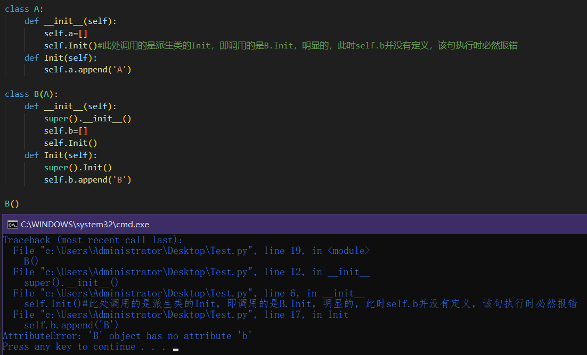

虽然想做一个PPAP梗图，但没技术力就算了，用文字形容就是：
(左手)Python动态性；
(右手)Python多继承；
(两手合起来)额~哦~，“类对象无此属性”、“错误调用”；

<br>

***

这里提供两份代码以及对应的运行结果，一份是Python的，一份是C++的。

在下面的代码中能明显看出来，Python中的基类调用的公有函数是属于派生类的，私有函数才是调用自个儿的，因此如果想要基类顺利调用自己的公有函数，就必须通过“类名.函数名(self,参数)”的方式进行调用。

<br>

### Python

```python
class A:
	def __init__(self,isPublic=False):
		if(isPublic):
			self.Print("aaa")
			# A.Print(self,"aaa")#要通过这种方式才能正确调用到
		else:
			self.__Print("aaa")
	def __Print(self,val):
		print(f">>>[PRIVATE]A-{val}")
	def Print(self,val):
		print(f">>>[PUBLIC]A-{val}")

class B(A):
	def __init__(self,isPublic=False):
		super().__init__(isPublic)
		if(isPublic):
			self.Print("bbb")
		else:
			self.__Print("bbb")
	def __Print(self,val):
		print(f">>>[PRIVATE]B-{val}")
	def Print(self,val):
		print(f">>>[PUBLIC]B-{val}")

if __name__=='__main__':
	print("it's Python")
	for flag in [False,True]:
		print(f'\nisPublic={flag}')
		B(isPublic=flag)
```


<br>


### C++

```cpp
#include<stdio.h>

class A {
public:
	A(bool isPublic = true) {
		if (isPublic)
			this->Print("aaa");
		else 
			this->__Print("aaa");
	}
public:
	virtual void Print(const char* ch) {
		printf_s(">>>[PUBLIC]A-%s\n", ch);
	}
private:
	virtual void __Print(const char* ch) {
		printf_s(">>>[PRIVATE]A-%s\n", ch);
	}
};

class B :public A {
public:
	B(bool isPublic=true) :A(isPublic) {
		if (isPublic)
			this->Print("bbb");
		else
			this->__Print("bbb");
	}
public:
	virtual void Print(const char* ch) {
		printf_s(">>>[PUBLIC]B-%s\n", ch);
	}
private:
	virtual void __Print(const char* ch) {
		printf_s(">>>[PRIVATE]B-%s\n", ch);
	}
};

int main() {
	bool flags[] = { false,true };
	bool flag = false;
	printf_s("It's C++\n");
	for (auto i = 0; i < 2; ++i) {
		flag = flags[i];
		printf_s("\nisPublic=%s\n", flag ? "True" : "False");
		B b(flag);
	}
	return 0;
}
```


<br>

### 额外示例-Python

如果上面的代码还不够直观，这里将补充一份Python示例代码以进一步说明多继承的潜在隐患，
虽然下例代码仅仅只是单继承，重写了Init函数，但都已经出现了调用错误，更不用说多继承可能会出现的公有函数同名问题。

```py
class A:
	def __init__(self):
		self.a=[]
		self.Init()#此处调用的是派生类的Init，即调用的是B.Init，明显的，此时self.b并没有定义，该句执行时必然报错
	def Init(self):
		self.a.append('A')

class B(A):
	def __init__(self):
		super().__init__()
		self.b=[]
		self.Init()
	def Init(self):
		super().Init()
		self.b.append('B')

B()
```




